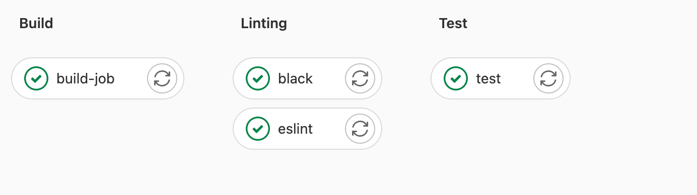

# CIS*3760 Sprint 9
### Team 202

**Group Members:**
    Christina, Laiba, Shayan, Karina, Tanya, Areesha, Karun

**App:**
AWS Lightsail, NGINX, Ubuntu Linux VM,
Flask, Gunicorn, REACT, HTML/CSS

**CI/CD:**
Black: linting Python files, esLint: linting JavaScipt files

# Purpose

Launching our VBA creation of a good course schedule on to an AWS Lightsail instance through a Linux VM. Flask, REACT, and HTML/CSS code and NGINX allow for our page to be accessed at **3.97.29.171** over Safari or Firefox, as Chrome blocks unsigned HTTPS certificates. Our course scheduler allows for F22 and W23 course selection, and autofill options for a curated semester schedule.

## AWS Server

**localAppIntegration** directory contains the version of our application that are be deployed locally in order to be viewed, but can be altered to be run over our AWS instance. This version is our most current one, displaying the furthest and latest progress made.
Launching this version requires following instructions found in [this video](https://www.youtube.com/watch?v=7LNl2JlZKHA&feature=youtu.be). User must ensure that files given are matching their appropriate location as shown in the video.

# Our Application

# Setup & Running

To stop once gunicorn has been left in the background:
- `pkill gunicorn`
- `sudo systemctl stop nginx`

Run Nodejs application:
- `cd /var/www/cis3760/localAppIntegration/client-2`
- `sudo npm run build`

Restart NGINX and run Gunicorn once in the `flask-2` directory:
- `cd /var/www/cis3760/localAppIntegration/flask-2`
- `sudo systemctl restart nginx`
- `gunicorn -w 3 server:app`

Leaving server in the background (while Gunicorn is running):
- cntrl + Z
- `bg`

## Alternate Running

Use the SHH key 3760greg or AWS credentials to access the AWS Lightsail instance. Run the following scripts:
- `bash install.sh`, to install all dependancies
- `bash run.sh`, to run or restart the web app
- `bash stop.sh`, to stop the web app

**Note:** *Bash scripts can be put in any directory on the Linux server*

### How We Made Our Instance 

Configuring NGINX (Also copied in the sprint-4 and sprint-5 repos):
- Viwe full instructions in [sprint-6](https://gitlab.socs.uoguelph.ca/cis37602/cis3760/-/tree/sprint-6), and [sprint-5](https://gitlab.socs.uoguelph.ca/cis37602/cis3760/-/tree/sprint-5)

